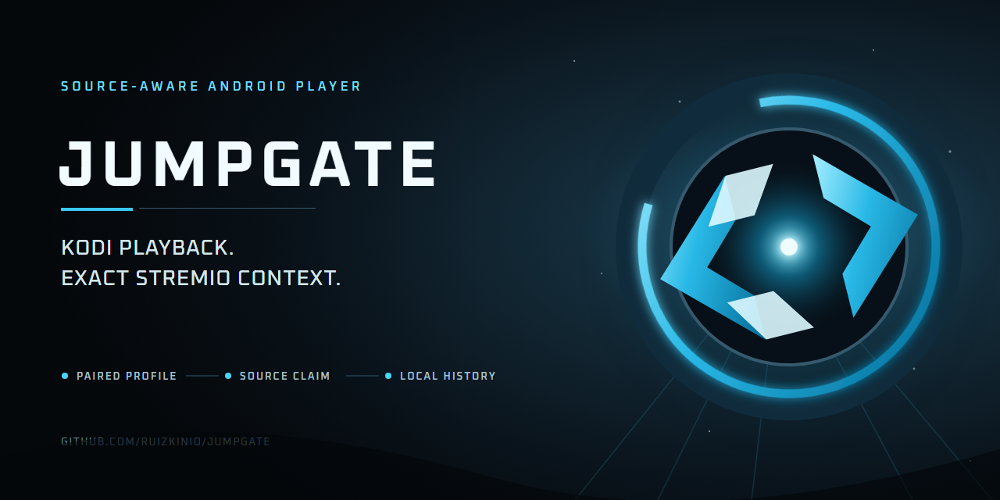

# Jumpgate

Jumpgate turns Kodi into a source-aware external player for Stremio. It keeps Kodi's
playback engine, settings, skins, local history, and subtitle add-ons while adding a
private Bridge that carries the selected Stremio source context to the player.

> **Pre-release:** the source-backed overhaul is still completing physical Android UAT,
> security review, stable signing, and coordinated release packaging. The production
> Bridge is deployed, but current development APKs and configured addon URLs are not a
> public release.

## Why Jumpgate

- Play Stremio streams through Kodi without replacing normal standalone Kodi behavior.
- Keep multiple paired profiles isolated by profile, device, session, and source claim.
- Use streams and subtitles from the Stremio addons selected by the user; Jumpgate is
  not tied to one catalog, debrid service, stream addon, or subtitle addon.
- Track local resume/history even when cloud synchronization is unavailable.
- Optionally synchronize canonical playback with Trakt.
- Deliver text, ASS/SSA, and integrity-checked VobSub subtitles while preserving Kodi
  subtitle selection, delay controls, themes, and existing subtitle add-ons.

## Components

| Component | Purpose |
| --- | --- |
| Jumpgate for Android | Kodi fork with external-player lifecycle, pairing, source claims, local history, claim-bound lifecycle delivery, loading overlay, and private subtitle delivery |
| Jumpgate Bridge | HTTPS Stremio addon, configuration UI, provider gateway, pairing service, playback identity, history API, Trakt OAuth, and private subtitle transport |
| Jumpgate Manager | Bundled Kodi program addon used to pair and manage profiles without changing normal Kodi settings screens |

## Requirements

- Android phone, tablet, TV, or streaming box supported by a published Jumpgate APK.
- A currently supported Stremio release signed into the account whose addons/providers will be
  imported: Android Mobile `2.3.2` or Android TV `1.10.4` for this release candidate.
- A network connection from both apps to the same HTTPS Jumpgate Bridge deployment.
- Optional Trakt account for cloud scrobbling and history synchronization.
- Optional TMDB v3 API key for metadata enhancements such as clearlogos. The key is
  common to the user's TMDB account and is not generated per device.

## Setup

Pair **before** installing the generated addon. A configured addon URL is private to
one Bridge profile and must not be shared between people or profiles.

1. Install the APK matching the Android device ABI. Most modern devices use
   `arm64-v8a`; older 32-bit devices may require `armeabi-v7a`.
2. Open Jumpgate directly once, then open **Add-ons > My add-ons > Program add-ons >
   Jumpgate Manager**. Both **Open** and **Configure** lead to its configuration page.
3. Choose **Open Native Manager**, then **Pair New Profile**. Keep the short-lived
   pairing code on screen.
4. Open the Bridge configuration page on a phone or computer and enter the pairing
   code. Codes accept the displayed hyphenated form and expire after ten minutes.
5. Optionally connect Trakt and enter a TMDB v3 key.
6. Import and select the Stremio providers for this profile.
7. Install the generated private addon into the signed-in Stremio app. Use the copy
   controls when the Stremio deep link cannot be opened on the current device.
8. In Stremio, set **Settings > Playback > Default player** to **External player**.
   Start a Jumpgate source and select **Jumpgate** in Android's player chooser. Use
   **Just once** during setup; optionally choose **Always** for matching Android video
   intents after validation. That choice can affect matching launches from other apps,
   and Android may ask again for a different stream scheme.

The normal setup never requires a Bridge URL to be copied into Kodi. Pair redemption
delivers the exact Bridge origin and device credentials automatically.

## Playback Identity

Jumpgate does not identify users or titles by IP address. Shared Wi-Fi, carrier NAT,
CGNAT, VPN changes, or multiple Stremio installations therefore cannot select another
profile. The Bridge uses authenticated profile/device capabilities and a bounded
source claim created from the actual Stremio provider response.

A canonical source claim is required before Jumpgate can write to Trakt. Titles,
filenames, URLs, artwork, torrent hashes, OpenSubtitles hashes, and IP addresses may
help local display or history, but they never authorize a Trakt identity.

If a source cannot be claimed, playback should still work and local resume/history is
still recorded. Jumpgate deliberately skips Trakt rather than scrobbling the wrong
film or episode.

## Streams And Addons

Jumpgate is designed for arbitrary Stremio stream and subtitle addons selected during
provider import, including direct HTTP(S), playlist-backed, torrent-backed, debrid,
and addon-proxied results. Container or URL shape is not identity:

- M3U/M3U8, M2TS, MKV, MP4, and similar sources can be passed to Kodi when the provider
  returns a playable transport.
- A transport can play even when it does not carry enough canonical metadata for
  Trakt. That session remains local-only instead of being guessed from the filename.
- Provider URLs, request headers, cookies, tokens, and subtitle source URLs remain
  encrypted or server-side and are not exposed in public playback claims.

Provider compatibility still depends on the provider returning a valid Stremio
resource and a transport Kodi can play. Representative AIOStreams, DMM, direct,
playlist, torrent, and subtitle providers are part of release UAT.

## Profiles

- Pairing is performed once per Jumpgate profile/device relationship.
- Several profiles can coexist in Jumpgate Manager.
- External-player launches select only an exact authenticated profile and source
  context; no global or IP-based fallback can cross profiles.
- Stremio account profiles that use different provider sets should install their own
  configured addon URL.
- Removing or re-pairing one profile must not expose or erase another profile's data.

## Trakt

Trakt is optional. A production Bridge deployment uses its own registered Trakt
application and exact OAuth callback. Users authorize that application in the browser;
they do not need to create a Trakt client for normal installation.

Jumpgate sends start, pause, resume, stop, and completion events only after a paired,
canonical source claim is active. Periodic start updates are suppressed while paused
or backgrounded. If Trakt authorization expires or becomes ambiguous, the Bridge
requires reauthorization instead of replaying a possibly rotated refresh token.

## Subtitles

Stremio subtitle results remain compatible with Stremio. For Jumpgate playback, the
Bridge can privately stage selected subtitle data and send integrity-bound parts to
the paired device. Text formats and atomic VobSub IDX/SUB pairs are supported. Kodi's
normal subtitle picker, delay controls, styling, skins, and installed subtitle addons
remain available.

Unsupported or ambiguous companion-file layouts fail closed; Jumpgate does not guess
a private `.idx`/`.sub` partner URL.

## Privacy And Safety

- Treat pairing codes as short-lived one-time secrets.
- Treat configured addon URLs, management links, and copied install URLs as account
  capabilities. Do not post them in issues, screenshots, logs, Reddit, or chat.
- Never send Stremio, Trakt, Fly.io, TMDB, debrid, or provider credentials to project
  maintainers.
- Bridge production mode requires PostgreSQL, Redis, private S3-compatible subtitle
  storage, stable encryption material, and HTTPS. It does not fall back to development
  storage when those services are missing.
- Playback identity never uses IP correlation. Client addresses are used only for
  transport-level abuse controls.

## Returning To Stremio

In external-player mode, Back first dismisses Kodi's OSD when it is visible. The next
Back returns the result to Stremio instead of opening Kodi's home screen. Standalone
Kodi keeps normal Kodi navigation behavior.

Stremio Android TV `1.10.4` currently opens **Who's watching?** after an
external-player round trip for Premium accounts with profiles, even when Stremio stayed
alive and received the playback result. Reselect the same profile to continue. Jumpgate
cannot safely suppress another app's profile screen, and it never guesses or automates a
Stremio profile. This upstream issue is tracked in
[`Stremio/stremio-bugs#2708`](https://github.com/Stremio/stremio-bugs/issues/2708).

## Troubleshooting

### Pairing fails

- Enter the code with or without its display hyphen.
- Generate a new code if the ten-minute timer expired.
- Confirm the device can reach the exact HTTPS Bridge shown by Jumpgate.
- Do not reuse a code already activated by another browser session.

### Trakt does not scrobble

- Confirm the Jumpgate profile is paired and Trakt is connected on that same profile.
- A local-only playback intentionally does not call Trakt.
- Reauthorize when the configuration page reports that authorization is required.
- Never solve a missing source claim by enabling filename, title, artwork, hash, or IP
  guessing.

### Jumpgate is missing from the player chooser

- Confirm Stremio's default player is **External player**. Selecting an internal player
  prevents Android's external-player chooser from opening.
- If another player opens immediately, Android remembered that app separately from
  Stremio. Open that player's Android **Open by default** or **Set as default** settings,
  clear only its defaults, then start the stream again and select **Jumpgate**.
- Switching Stremio away from **External player** and back does not clear Android's
  remembered app. Do not clear Stremio app data or lose the signed-in profile.

### Stremio spins after returning from Jumpgate

- Do not use Android Mobile `2.1.5`; it has a confirmed identical-stream replay bug. Update to the
  supported Android Mobile `2.3.2` or Android TV `1.10.4` baseline.
- Confirm both apps are on the release versions listed together in the same GitHub
  release.
- Force-close both apps only as a diagnostic; repeated playback must work without that
  workaround before a build is considered release-ready.
- Include sanitized version numbers and reproduction steps in an issue, but never a
  configured addon URL, bearer token, provider URL, or raw private log.

### Stremio asks "Who's watching?" after playback

- On Android TV `1.10.4`, this is a confirmed Stremio limitation for Premium accounts
  with profiles, not proof that Jumpgate lost the playback result.
- Reselect the same profile. The same stream must then launch again without force-closing
  Stremio or Jumpgate; an infinite spinner or failed relaunch is still a bug.
- Do not clear Stremio data or ask Jumpgate to select an account profile automatically.

### No clearlogo appears

- Clearlogos are optional and not available for every title.
- Configure TMDB on the Bridge or profile, and confirm the title has canonical metadata.
- Jumpgate falls back to text when no approved `image.tmdb.org` logo is available.

## Repositories

- `Jumpgate`: release overview, user guide, and coordinated releases.
- `Jumpgate-kodi`: Kodi fork and Android build pipeline.
- `Jumpgate-bridge`: Bridge service, Stremio addon, configuration UI, and deployment.

The clean public repositories are created only from audited release candidates. Old
development histories containing removed credentials or credential-shaped fixtures
are not release history.

## Release Validation

Every coordinated release must pass the public [device UAT protocol](docs/UAT.md) in
addition to protected CI. A workaround that requires force-closing either app,
manually copying a Bridge URL into Kodi, or guessing content identity is a failed
release gate.

## Licenses

Jumpgate's Kodi fork remains GPL-2.0-or-later and retains Kodi's notices and upstream
history. Jumpgate Bridge is MIT licensed. Third-party names and marks, including Kodi,
Stremio, Trakt, and TMDB, belong to their respective owners; this project is not an
official product of those services.
